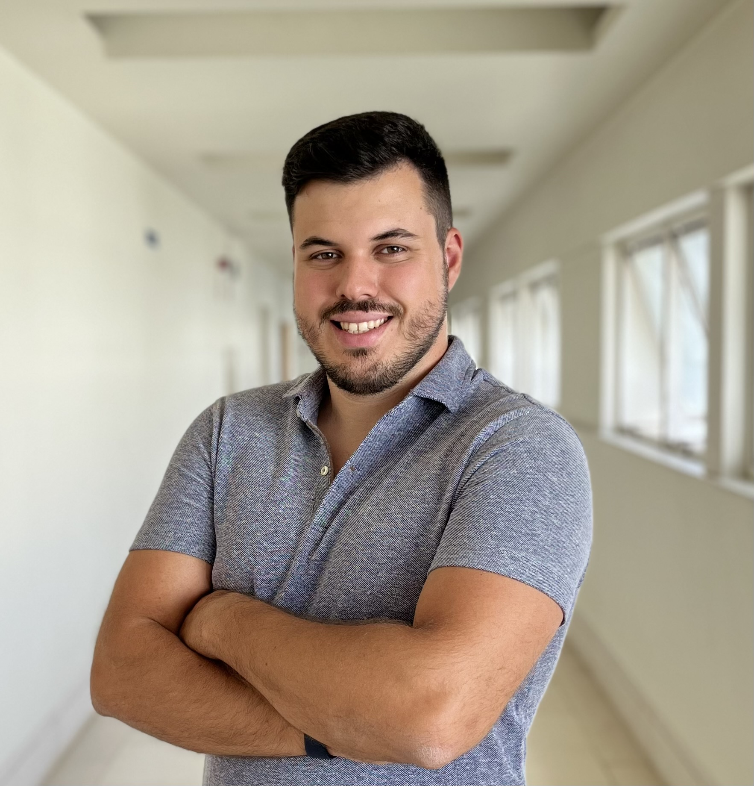

## About Me

I am a PhD student at the <a target="_blank" href="https://ciencias.ulisboa.pt/">Faculty of Sciences of the University of Lisbon</a> (FCUL), conducting research at <a target="_blank" href="https://www.lasige.pt/">LASIGE</a>. I am supervised by <a target="_blank" href="http://www.di.fc.ul.pt/~catiapesquita/">Professor Catia Pesquita</a> from FCUL and <a target="_blank" href="https://www.city.ac.uk/about/people/academics/ernesto-jimenez-ruiz">Dr Ernesto Jiménez-Ruiz</a> Lecturer of Artificial Intelligence at <a target="_blank" href="https://www.city.ac.uk/about/schools/science-technology">School of Science & Technology of City, University of London </a>.

I am interested in shortening the gap between artificial nets and their biological counterparts, currently my research focuses on using Neuro-Symbolic AI to improve Knowledge Graph Alignment.

I have previously conducted research that focused on using deep reinforcement learning approaches to improve algorithms for n-way data analysis.

For a more thorough and structured description of my work you may [contact me](#contact) and request my CV.

Links:
  <a target="_blank" href="https://scholar.google.com/citations?user=HJy-H6sAAAAJ"><i class="fas fa-graduation-cap"></i></a> ⚭
  <a target="_blank" href="https://orcid.org/0000-0001-6724-899X"><i class="fab fa-orcid"></i></a> ⚭
  <a target="_blank" href="https://github.com/PedroCotovio/"><i class="fab fa-github"></i></a> ⚭
  <a target="_blank" href="https://www.linkedin.com/in/pedro-cotovio"><i class="fab fa-linkedin"></i></a>

## Research Interests

I am currently mainly interested Neuro-Symbolic AI but my interests expand to all things deep & reinforcement learning.

* Neuro-Symbolic AI
* Deep Learning
* Reinforcement Learning
* Bioinformatics
* Semantic Web
* Knowledge Graph Alignment / Ontology Matching
* Cognition

My interest go much further than these topics, so if you would like to collaborate on any problem that I might be of use, feel free to [contact me](#contact).

## Teaching

## 2022/2023

[comment]: <> (### Intelligent Systems, Faculty of Sciences of the University of Lisbon)

[comment]: <> (Teaching Theoretical-Pratical classes, offered to different bachelor degrees within the Faculty, in the 2nd Semester.)

[comment]: <> (Class covers Artificial Intelligence Fundamentals, such as search algorithms, going all the way to Machine Learning Fundamentals.)

[comment]: <> (### Advanced Machine Learning, Faculty of Sciences of the University of Lisbon)

[comment]: <> (Teaching Theoretical-Practical classes, offered to all Department of Informatics Masters' Programs in the 2nd Semester.)

[comment]: <> (Class focuses on more advanced topics such as Ensemble Learning, Markov Models, Deep Learning and Reinforcement Learning.)

### Programming I, Faculty of Sciences of the University of Lisbon

Teaching Theoretical-Practical classes, offered to first year students of 7 Bachelor Programs.

Course focuses on programming fundamentals.

[comment]: <> (## Science Communication)

[comment]: <> (## Publications)

## Office Hours

To make an appointment during office hours click [here](https://doodle.com/bp/pedrocotovio/-consultation-hours).

## Contact

You may contact me at: pgcotovio [at] ciencias.ulisboa.pt
